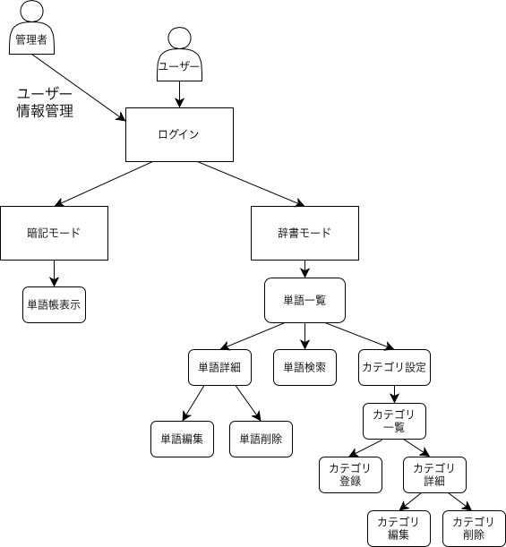

ユースケース

# ユースケース

##　ユースケース図

## 利用する人（アクター）

| 名前 | 説明 |
|----|----|
| 一般ユーザー | 単語帳を使って、単語登録・暗記をするユーザー |
| 管理者 | 単語やカテゴリやユーザーを管理する人 |
| Google | ログイン認証を行う外部サービス |

---

## ユースケース一覧

### UC-01 ログイン（Google）
- 利用者：一般ユーザー、管理者
- 内容：Googleアカウントを使ってログインする
- 流れ：
  1. ログインボタンを押す
  2. Googleのログイン画面が表示される
  3. 認証が成功するとログインできる
- 備考：Google OAuth 2.0 を使用

---

### UC-02 ログアウト
- 利用者：一般ユーザー、管理者
- 内容：ログイン状態を終了する
- 流れ：
  1. ログアウトボタンを押す
  2. トップページに戻る

---

### UC-03 単語を登録する
- 利用者：一般ユーザー
- 内容：単語と意味を登録する
- 流れ：
  1. 登録画面を開く
  2. 単語と意味を入力する（カテゴリ選択も可）
  3. 登録ボタンを押す

---

### UC-04 単語を一覧で見る
- 利用者：一般ユーザー、管理者(閲覧のみ)
- 内容：登録した単語を一覧で表示する
- 流れ：
  1. 単語一覧画面を表示する

---

### UC-05 単語を検索・並び替える
- 利用者：一般ユーザー、管理者(閲覧のみ)
- 内容：単語を検索したり並び替えたりする
- 流れ：
  1. 検索条件や並び替え方法を選ぶ
  2. 条件に合った単語が表示される

---

### UC-06 単語の詳細を見る
- 利用者：一般ユーザー、管理者(閲覧のみ)
- 内容：単語の詳しい内容を見る
- 流れ：
  1. 一覧から単語を選ぶ
  2. 詳細画面が表示される

---

### UC-07 単語を編集する
- 利用者：一般ユーザー
- 内容：登録した単語を修正する
- 流れ：
  1. 編集画面を開く
  2. 内容を修正して保存する

---

### UC-08 単語を削除する
- 利用者：一般ユーザー
- 内容：単語を削除する
- 流れ：
  1. 削除したい単語を選ぶ
  2. 削除ボタンを押す

---

### UC-09 暗記モードを使う
- 利用者：一般ユーザー
- 内容：単語を覚えるためのモードを使う
- 流れ：
  1. 暗記モードを開始する
  2. 単語が表示される
  3. ボタンを押すと意味が表示される
  4. 次の単語に進む

---

### UC-10　CSVでまとめて登録する
- 利用者：一般ユーザー
- 内容：CSVファイルを使って単語をまとめて登録する
- 流れ：
  1. CSVファイルを選ぶ
  2. 単語がまとめて登録される
- 備考：APIは使わずに実装する

---

### UC-11 CSVで書き出す
- 利用者：一般ユーザー
- 内容：登録した単語をCSVファイルで保存する
- 流れ：
  1. 書き出しボタンを押す
  2. CSVファイルがダウンロードされる
---

### UC-12 カテゴリを管理する
- 利用者：一般ユーザー、管理者(閲覧のみ)
- 内容：カテゴリを追加・編集・削除する
- 流れ：
  1. カテゴリ設定画面を開く
  2. カテゴリ一覧を表示する（追加、削除可）

---